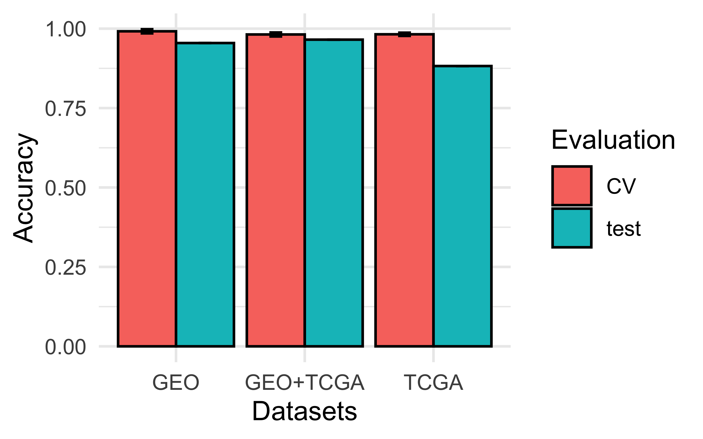

# Cancifier

Cancer is the second leading cause of deaths globally and accounts for 10 million deaths annually, 90% of which are caused by metastatic cancers ("Cancer", 2018). The effectiveness of contemporary cancer treatments, including targeted therapies largely depends on knowledge of the patient’s primary tumor. However, up to 5% of all cancer patients have metastatic tumors for which routine diagnostic tools cannot locate the primary site. This results in a diagnosis of cancer of unknown primary (CUP) (Wei et al, 2014; Zhao et al, 2020). CUP can be due to one of the following reasons:

- 
The primary cancer can be too small to detect.

- 
The body’s immune system can kill the primary cancer.

- 
The primary cancer can also be removed during surgery for another condition and doctors may not know that the cancer had formed ("Carcinoma of Unknown Primary Treatment", 2018).

Most CUP patients have a dismal prognosis with a median overall survival of 8-11 months and one-year survival of only 25% ("Carcinoma of Unknown Primary Treatment", 2018). Therefore, novel diagnostic methods are required to improve both speed and accuracy of cancer tissue of origin identification.

It is known that most metastatic samples retain the gene expression profile of the primary tumour and can be used to predict its primary site (note the clustering of gene expression in primary and metastatic tumor samples in the image below).

  

There exist a number of techniques that can be used to determine the transcriptomic profile of a cell. The most widely used are microarray platforms and newer RNA sequencing technologies which serve to measure the activity of thousands genes at a time, creating a picture of cell fate and pathology. Since metastatic cancers are believed to retain the gene expression profile of their primary site, machine learning methods can be used to predict the primary site of a cancer.

The aim of our project Cancifier (Cancer classifier) was to develop a bioinformatic pipeline that can accurately identify the site of origin of a metastatic cancer based on its transcriptomic profile obtained via either RNA-seq or microarray technologies. More specifically, we aimed to make a predictive improvement to an existing method which had an average accuracy of 86.7% (Liu et al., 2020).

  ## Methods and results

Twenty three RNA microarray datasets were obtained programmatically from the Gene Expression Omnibus (GEO) database, and fifteen RNA-Seq datasets were downloaded from the The Cancer Genome Atlas database (TCGA). All dataset IDs were found using the Human Cancer Metastasis Database [HCMDB](https://hcmdb.i-sanger.com) which is an integrated database designed to store and analyze large scale expression data of cancer metastasis.

The notebook preprocess.ipynb contains the code that was used to preprocess and normalize the data. The following steps were taken to preprocess the data:

- 
Mapping of Affymetrix microarray probes to the corresponding gene names. The mapping was done using DAVID database (Huang et al., 2009).

- 
Quantile normalization and scaling to zero mean and unit variance. This was done separately for healthy and tumor samples, because quantile normalization assumes the same distribution of gene expression in each sample. The aim of this step was to remove inter-dataset variation and capture mean-variance relationships within each dataset.

- 
Feature selection for better model performance and faster computational times. Since the majority of genes are housekeeping genes, not all of the genes present in the dataset will be useful in distinguishing between different tissues. Therefore, we performed differential gene expression analysis to select only features useful for subsequent machine learning steps. To select differentially expressed genes (genes that are expressed in one tissue, but not the others), we selected genes by computing the differential gene expression (p<0.05) in each subtype in comparison with the other subtypes of the same cancer type as was outlined by Zhao et al., 2020. Bonferroni correction was used to avoid spurious positives, and a more conservative p-value was used to avoid filtering out some potentially useful features.

- 
t-SNE and Principal component analysis (PCA) were used to analyze the effectiveness of preprocessing. Ideally, the data should segregate by tissue type, but the batch effect may be a confounding variable when different datasets are merged. Therefore, we included batch as a covariate to check whether our preprocessing successfully corrected for batch effect and whether true variation has been preserved (figure below, right). Since the number of features was large, t-SNE was performed on reduced data (20 principal components) to suppress any noise and speed up the computation of pairwise distances between samples.

- 
Since our dataset was imbalanced, to avoid undersampling we used SVC model which assigns weight to each class. With SVC, we found accuracy of 0.98 in the internal 10-fold cross-validation step, and the accuracy of 0.97 in the test dataset which contained true metastatic cancer samples for which the tissue of primary origin was known.

## Conclusion

In summary, we have demonstrated the utility of our machine learning algorithms to decode gene expression profiles and better meet the clinical challenge of identifying the primary site of multiple cancers.
